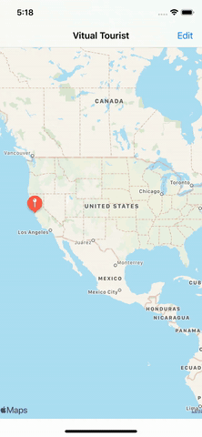

# VirtualTourist 
Udacity iOS Nanodegree Project

#### Summary 
This application was created specifically for Udacity's iOS Developer Nanodegree. Virtual Tourist app allows users specify travel locations around the world, and create virtual photo albums for each location. The locations and photo albums will be stored in Core Data.

The basic concept of this is app is to generate a collection of images of a particular location by defining it's latitude and longitude and saving them for the user using core data. The users can also generate a new collection of images and select, remove the ones that they do not want in their collection. The images are from Flickr generated by making network calls.  

Project Rubrics can be found [here](https://docs.google.com/document/d/1j-UIi1jJGuNWKoEjEk09wwYf4ebefnwcVrUYbiHh1MI/pub?embedded=true).

#### Requirements
- Xcode 11.4
- Swift 5

#### Technologies Used In Application:
- CoreData
- Networking
- Stack views
- Collection View and Flow layout
- Long press getures
- Swift

#### Implementation
- Use of URLSessions to interact with a public restful API.
- Creating a user interface that intuitively communicates network activity and download progress.
- Storing media on the device file system.
- Use of Core Data for local persistence of an object structure.

